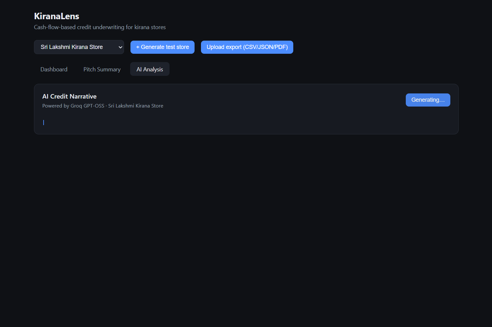

# KiranaLens

Fintech cash-flow underwriting tool for kirana (small Indian retail) stores.
Estimates lending risk from transaction patterns instead of formal credit
history, and explains the score factor-by-factor.


## Structure

```
kiranalens/
  server/
    models/
      Store.js          Mongoose schema — store profile, transactions[], restocks[]
                         (subdocuments have _id suppressed)
      StoreScore.js     Mongoose schema — cached score output, factors[], fingerprint
                         (subdocuments have _id suppressed; top-level _id stripped from responses)
    dataGenerator.js    Synthetic daily UPI+cash transactions, seasonal/weekly patterns
    scoring.js          Explainable scoring: stability, trend, UPI adoption, resilience, restock consistency
    ml/model.js         Second scoring path: logistic regression trained at boot on synthetic stores;
                        outputs the same factor-style breakdown via weight-derived pseudo-factors
    normalizers/        Upload normalizers: canonical daily-aggregate CSV/JSON, Google Pay
                        "Get Statement" PDF; PhonePe pending a sample export (TODO stub)
    ai/
      narrative.js      Groq streaming SSE credit narrative (buildPrompt, streamNarrative)
      alert.js          Groq alert generation when the recommended score drops 8+ points
    index.js            REST API — persists to MongoDB via Mongoose, score caching with fingerprint + TTL
  client/
    index.html          React dashboard (CDN React, no build step) — sales chart, score
                        breakdown, pitch-summary tab, AI Analysis tab with live streaming
                        narrative and blinking cursor
  docker-compose.yml    Starts Express server + mongo:7 container, wires MONGO_URI automatically
  .env.example          Template for local dev environment variables
```

## Run it

### Docker (recommended)

```bash
# Windows PowerShell
$env:GROQ_API_KEY="your_groq_key_here"
docker-compose up --build

# Mac/Linux
GROQ_API_KEY=your_groq_key_here docker-compose up --build
```

### Local dev (without Docker)

```bash
cd server
cp .env.example .env   # set GROQ_API_KEY; if not using Docker, change MONGO_URI
npm install
npm start                  # http://localhost:4000
```

Then open `client/index.html` directly in a browser.

`server/index.js` loads `.env` via `dotenv`, so `PORT` and `MONGO_URI` from
`.env` apply when running outside Docker. Without a `.env`, defaults are
`PORT=4000` and `mongodb://127.0.0.1:27017/kiranalens`.

Note: `.env.example` ships with the Docker Compose hostname
(`mongodb://mongo:27017/kiranalens`), which only resolves inside Docker. For
local dev, change it to `mongodb://127.0.0.1:27017/kiranalens` and keep a
local MongoDB running on 27017. The AI narrative/alert features need a
`GROQ_API_KEY`; under Docker it must be added to the server service in
`docker-compose.yml` (it is not wired to the host `.env` automatically).

On first boot with an empty database, the server seeds three preset stores
automatically.

## API

- `GET  /api/stores` — list stores
- `POST /api/stores/generate` — generate a new synthetic store
  (body: `storeName`, `baseDailySales`, `upiAdoption`, `volatility`, `badPatchProbability`)
- `POST /api/stores/upload` — multipart upload (`file` field, CSV, JSON or
  PDF, ≤10 MB) of a real UPI/POS export; normalized rows are stored as a NEW
  store. Supported today:
  - KiranaLens canonical daily-aggregate CSV
    (`date,upiAmount,cashAmount,upiTxnCount,cashTxnCount`) and the same rows
    as JSON.
  - Google Pay "Get Statement" PDF (`server/normalizers/gpay.js`). The GPay
    export has no direction column — direction is parsed from the statement
    text ("Received from" vs "Paid to"); only received rows count as store
    revenue, paid-out rows are tallied and excluded. Bank names, account
    digits and UPI transaction IDs are never stored or logged.
  PhonePe statement import is not wired yet — paste a sample export to add it.
- `GET  /api/stores/:id` — raw transaction data
- `GET  /api/stores/:id/score` — both scores, labeled clearly:
  `ruleBasedScore` (explainable baseline) and `modelScore` (learned
  pattern), each with `{score, recommendation, suggestedLoanRange, factors}`;
  plus shared `avgDailySales` / `avgMonthlyRevenue`.
- `GET  /api/stores/:id/narrative` — Server-Sent Events (SSE) stream of an
  AI credit narrative via Groq (`data: {"text": "chunk"}` until `data: [DONE]`);
  returns 400 if the store has not been scored yet.

## Data layer

Two MongoDB collections managed via Mongoose:

- **`stores`** — store profiles with daily transaction arrays
  (`upiAmount`, `cashAmount`, `totalAmount`, `upiTxnCount`, `cashTxnCount`)
  and restock events. Modeled in `server/models/Store.js`.
- **`storescores`** — cached scoring output keyed by `storeId`. Modeled in
  `server/models/StoreScore.js`. Each cached doc holds BOTH scoring paths
  for the same fingerprint: the rule-based result (from `scoring.js`) and
  the ML model result (`ml/model.js`, a logistic regression trained at boot
  on synthetic stores). Both are computed on first access and reused so
  neither engine reruns on every `GET /api/stores/:id/score`.

Cache invalidation triggers when either condition is met:

1. The store's transactions/restocks changed — detected via `dataFingerprint`
   stored with each cached score.
2. The cached score is older than 1 hour (TTL).

## Scoring model (two paths, same shape)

**Rule-based (explainable baseline)** — five hand-tuned factors, 0–100 total:

| Factor | Range | Signal |
|---|---|---|
| Revenue stability | 0–30 | Lower day-to-day volatility scores higher |
| Sales trend | −10 to +20 | Growing vs shrinking revenue over time |
| Digital payment adoption | 0–20 | UPI share — verifiable and traceable |
| Resilience to disruptions | 0–20 | Frequency of severe low-sales days |
| Inventory/restock consistency | 0–10 | Regularity of restock intervals |

**Score ≥ 70** → APPROVE · **45–69** → REVIEW · **< 45** → REJECT

Suggested loan range is sized off estimated monthly revenue.

Intentionally rule-based — every factor score is answerable in one sentence.

**Model-based (learned pattern)** — a logistic regression (`ml/model.js`)
trained at server boot on ~500 synthetic KiranaLens stores, labeled by the
generator's latent parameters (volatility, bad-patch probability, UPI
adoption, revenue scale) rather than by the rule engine. It consumes the
same five signals as the rules and outputs a probability of creditworthiness
(×100 = score). Its per-feature weights are projected onto the same five
factor labels/maxPoints as pseudo-factors so the dashboard renders both
breakdowns identically — the two scores can legitimately disagree.

This model has **not** been validated against real transaction data; treat
its output as experimental, not a production risk estimate.

Both paths share the same decision bands: **≥ 70** → APPROVE ·
**45–69** → REVIEW · **< 45** → REJECT.